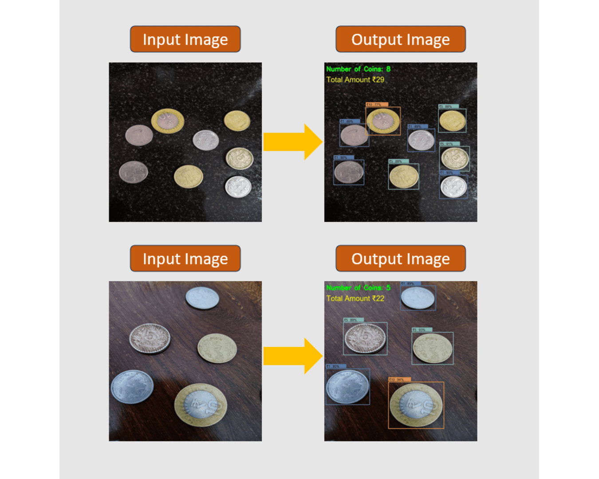
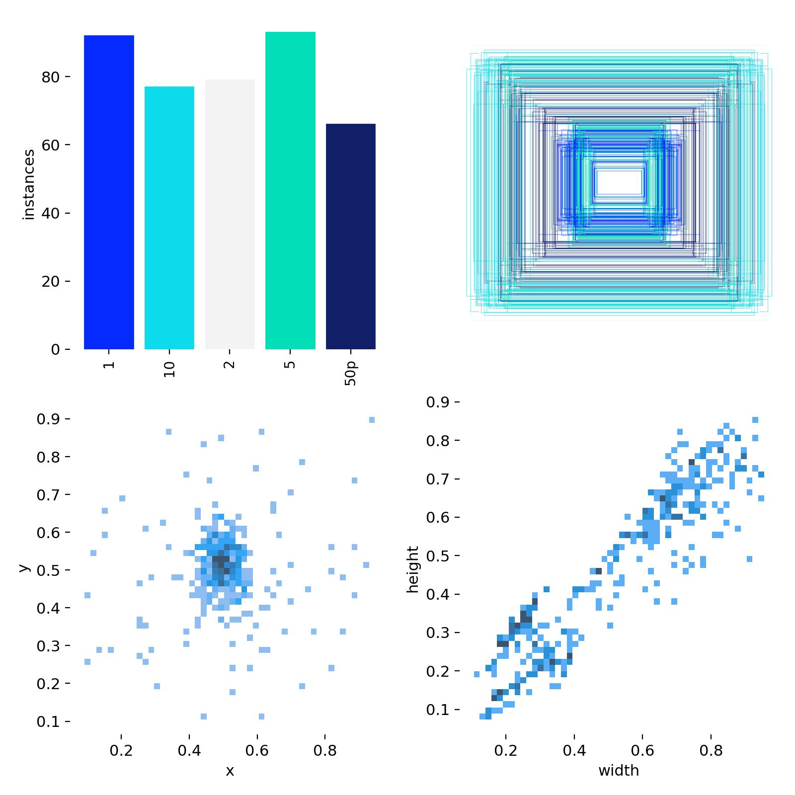
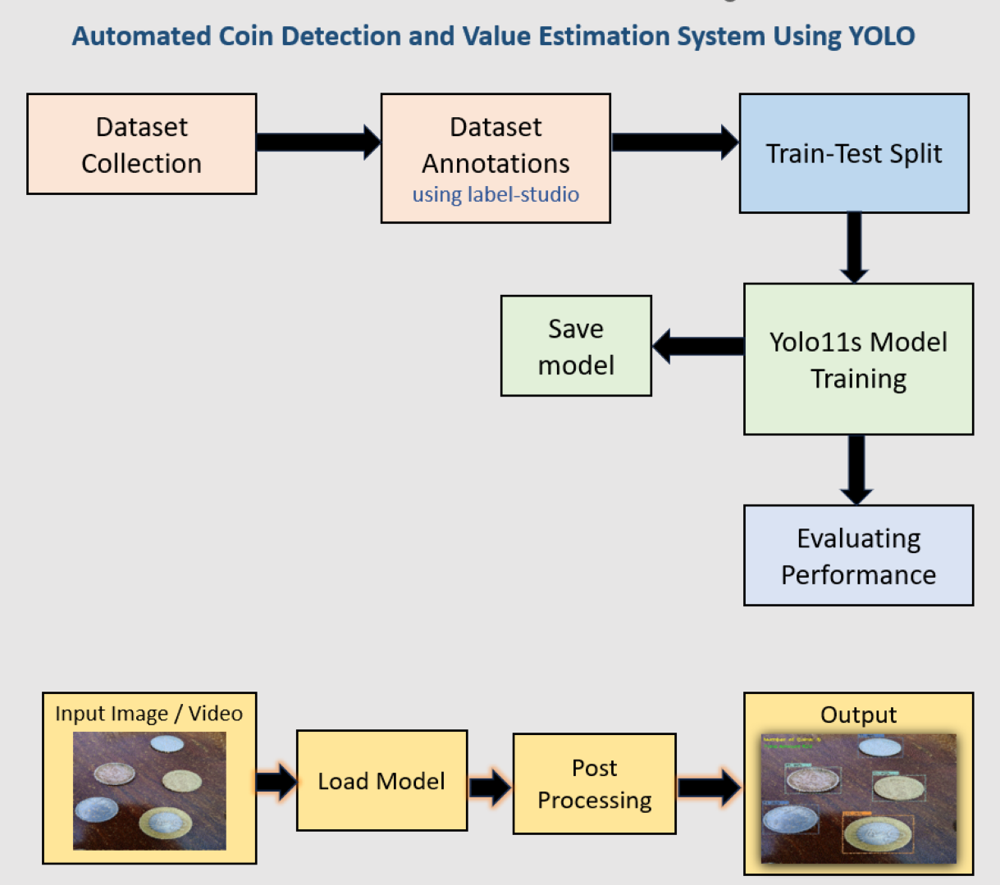

# IndiCoin: Automated Coin Detection and  Value Estimation System using Yolo


This project uses YOLO to detect and estimate the value of coins from images.




## Dataset Overview



## Project Workflow

1. **Prepare Dataset**
   - Organize images and annotations.
   - Create `data.yaml` file with dataset paths.

2. **Train/Test Split**
   - Split the dataset into training and testing sets.

3. **Train YOLO Model**
   - Training Yolo model for Detection and Classification

4. **Model Saving**
   - Trained model is saved automatically after training.

5. **Evaluation & Testing**
   - Evaluate model performance on the test set.

6. **Model Inference**
   - Use trained model to detect and estimate coin values on new images.

## Block Diagram



---

## Requirements

- Python
- YOLOv8 (Ultralytics)
- Torch
- OpenCV

Install requirements:
```bash
pip install ultralytics opencv-python torch
```


