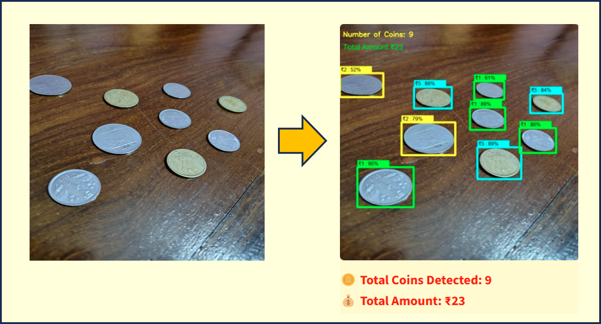
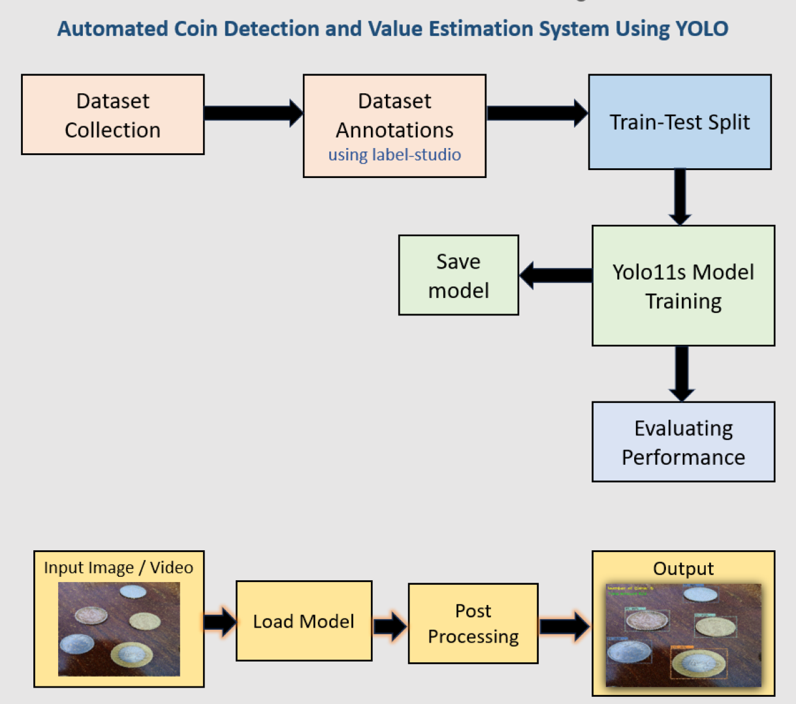

# IndiCoin: Automated Coin Detection and  Value Estimation System using Yolo

The IndiCoin project is a computer vision-based solution that uses the YOLO (You Only Look Once) deep learning model for detecting and estimating the value of coins in images. The model is trained to detect various Indian coin denominations and classify them accurately, providing an automated estimation of the total coin value present in any given image.

The project includes a dataset of Indian coins, annotated using tools like Label Studio, and a YOLO-based object detection and classification pipeline. After training the model, it can infer the value of coins in real-time or batch processing applications. The system can be useful for various real-world applications like coin-based inventory systems, smart vending machines, or any system that requires automatic recognition and summation of coins.

**Check out the live demo on Streamlit**:  
[https://<your-streamlit-username>.streamlit.app](https://indicoin-exbtr69h9xu2krgpzreu4v.streamlit.app/)





## Project Workflow

1. **Prepare Dataset**
   - Organize images and annotations.
   - Create `data.yaml` file with dataset paths.

2. **Train/Test Split**
   - Split the dataset into training and testing sets.

3. **Train YOLO Model**
   - Training Yolo model for Detection and Classification

4. **Model Saving**
   - Trained model is saved automatically after training.

5. **Evaluation & Testing**
   - Evaluate model performance on the test set.

6. **Model Inference**
   - Use trained model to detect and estimate coin values on new images.

## Block Diagram



---

## Requirements

- Python
- YOLOv8 (Ultralytics)
- Torch
- OpenCV

Install requirements:
```bash
pip install ultralytics opencv-python torch
```


