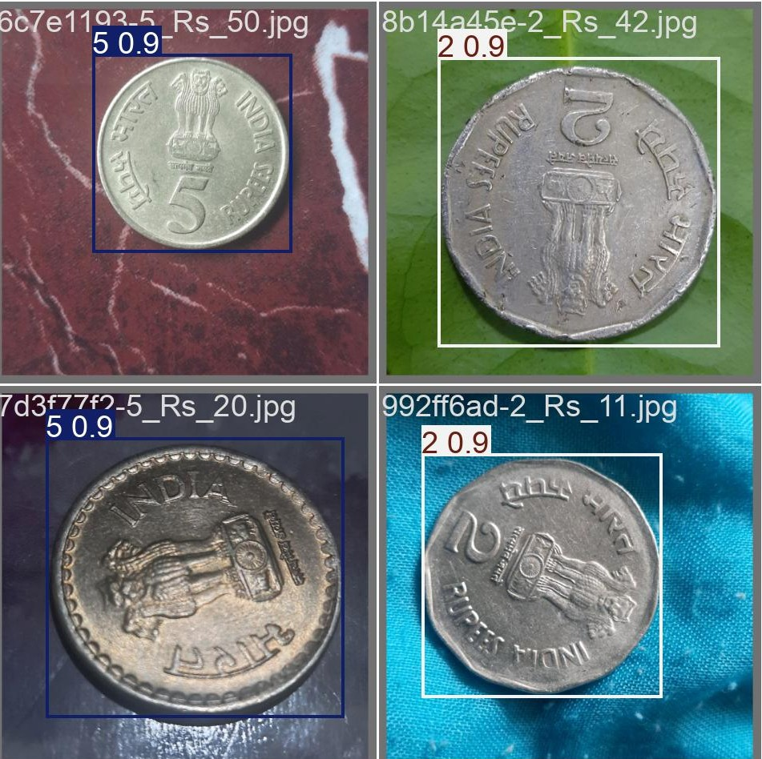
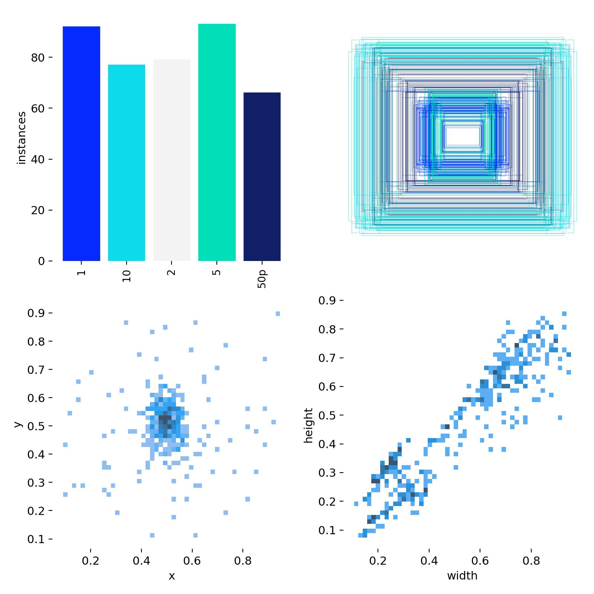

# Indian Coin Detection using YOLO11

This project fine-tunes a pre-trained YOLO11s model to detect Indian currency coins: ₹1, ₹2, ₹5, ₹10, and 50 paise. The model is trained on custom-labeled images and can be used to detect coins in real-time or static images.

<p align="center">
  
</p>

---

## Model Details

- **Base Model**: YOLO11s
- **Framework**: PyTorch
- **Classes**:
  - 0: 50 Paise
  - 1: ₹1
  - 2: ₹2
  - 3: ₹5
  - 4: ₹10
- **Annotation Format**: YOLO (class, x_center, y_center, width, height)
- **Input Size**: 640x640

---

## 📊 Dataset Annotation Overview



### Clone the Repository

```bash
git clone https://github.com/nishanthi-ds/Indian-Coin-Detection-Using-YOLO11s.git
```


